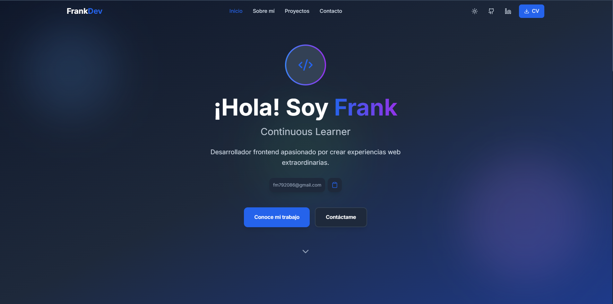

# 💼 Portfolio Personal

Un sitio web desarrollado para mostrar mis proyectos, habilidades y experiencia como **desarrollador de software**.  
Diseñado con un enfoque moderno, animaciones dinámicas y un diseño responsive para ofrecer una experiencia clara y atractiva a reclutadores y visitantes.

---

## 🚀 Objetivo del proyecto
El propósito de este proyecto fue crear un **portfolio profesional** que me represente, donde pueda:

- Mostrar mis proyectos destacados.  
- Presentar mis habilidades técnicas y herramientas que manejo.  
- Dar un espacio para que me contacten fácilmente.  
- Practicar con las tecnologías modernas que estoy aprendiendo.  

---

## 🛠️ Tecnologías utilizadas
- ⚛️ [React](https://react.dev/) (si lo usaste en alguna sección).  
- 🎨 [TailwindCSS](https://tailwindcss.com/) – Para el diseño responsive.  
- 🌐 [Netlify](https://www.netlify.com/) – Para el despliegue.  

---

## ✨ Features
- 📂 **Sección de proyectos** con enlaces a demos y repositorios.  
- 🧑‍💻 **Sobre mí** con mi experiencia y objetivos.  
- 📱 **Diseño responsive** optimizado para desktop y mobile.  
- 📬 **Formulario de contacto** funcional para conectar fácilmente.  
---

## 📚 Lo que aprendí
- Mejores prácticas en **diseño responsive** con TailwindCSS.  
- Optimización de un sitio para su despliegue en producción.
- Buenas practicas   

---

## 🧩 Retos encontrados
- Mantener el balance entre **diseño atractivo y performance**.  
- Resolver bugs en animaciones al cambiar entre secciones.  
- Asegurar la compatibilidad en **móviles y navegadores modernos**.  

---

## 🔗 Demo
El proyecto está desplegado en **Netlify**:  
👉 [Ver portfolio en línea](https://ankdev.netlify.app/)

---

## 🖼️ Screenshots
Aquí una vista previa de mi portfolio:  

  

---

## 📌 Próximos pasos
- Mejorar las **animaciones con ScrollTrigger**.  
- Incluir sección de **blog** para compartir artículos técnicos.  
- Optimizar aún más el SEO con **metadatos personalizados**.  

---

✍️ _Proyecto desarrollado por [3AeMe]([https://github.com/TU-USUARIO](https://github.com/3AeMe3/Portfolio-Personal/))_
